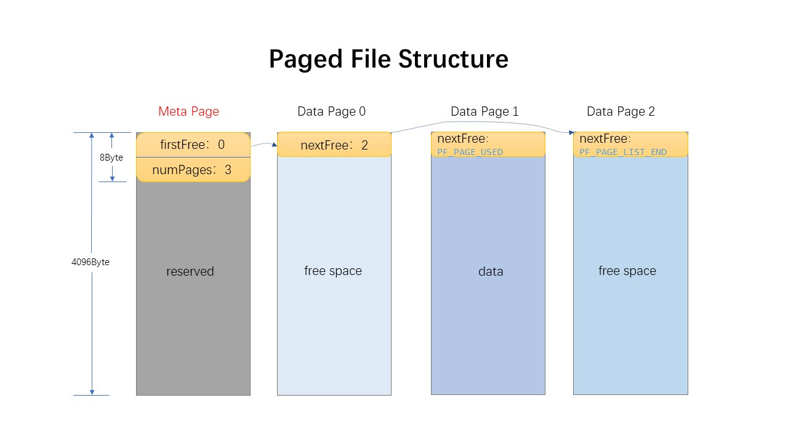
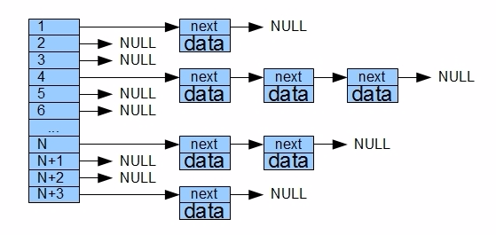
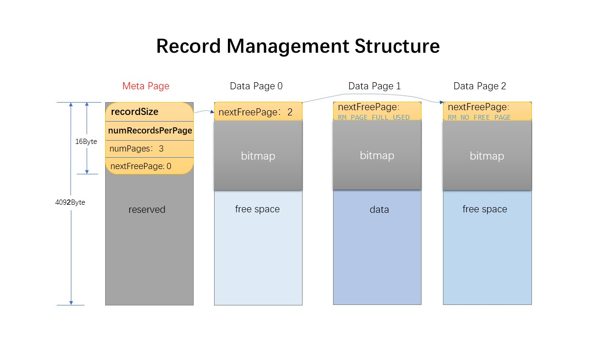

# Redbase 设计笔记

## 一、简介

这里将记录下本人在学习实现 Redbase 简易数据库时所作的笔记。

一些已经在 [Database System Implementation - Stanford CS346 Spring 2015](https://web.stanford.edu/class/cs346/2015/) 官方文档中描述的代码细节将不再说明。

## 二、分页文件 Paged File

> 官方文档链接：[RedBase Part 0: The Paged File Component](https://web.stanford.edu/class/cs346/2015/redbase-pf.html)

### 2.0 概述

分页文件在文件中的组织方式如下：



> PPT 画图，真不容易...

其中，一个文件被划分为多个页面 (Page)，每个页面大小为 4096 字节，与内存页面大小相符。文件中第一页用于存放一些元数据，包括**指向第一个空闲页的页索引**和**数据页面的个数**。后面的每一页，除开每页首部的4个字节 `nextFree` 变量用于标记下一个空闲页位置以外，每页剩余的 4092 字节用于存放上层数据。

> 例如，The Record Management Component （RM）的所有数据（包括元数据和实际有效数据），都会存放在这些每页大小为4092字节的 PF 数据页中。
>
> 对于 RM 结构而言，它们将不会感知 PF 内部结构的这些变量。

这种分层结构类似于计网协议栈，自顶向下，注意**上图中的 Page 页号只在 PF 逻辑中使用**。换句话说，PF 中的页号不能用于其他部件。

Paged File 逻辑根据代码分为几个部分，分别是：

1. `pf_buffermgr.[cc,h]`: 缓冲区管理逻辑
2. `pf_filehandle.cc`: 文件处理逻辑
3. `pf_hashtable.[cc,h]`: 哈希表存储逻辑
4. `pf_manager.cc`: 总管理器逻辑
5. `pf_pagehandle.cc`: 页处理逻辑
6. `pf_statistics.cc`: 统计信息处理逻辑

接下来简单介绍一下各个部分的逻辑。

### 2.1 pf_hashtable

该哈希表用于存放 **<页面索引, 槽索引>** 映射对，其中页面索引用 **(文件,页号)** 这样的二元组来表示，其底层表示为 `(fd, pageNum)` 这样的 **(文件描述符，页号)** 对。同时，只支持增删查三种操作。

每个页面实际存储的数据位于结构 `PF_BufPageDesc` 中的 pData 指针。而这类结构以数组形式存放在 `PF_BufferMgr` 中的 `bufTable` 里，因此**槽索引**指的是**页面索引所对应的 PF_BufPageDesc 结构体，存放在 bufTable 中对应的索引号**。 

对于所打开的文件集合来说，不同的文件拥有着不同的文件描述符; 对于相同的文件来说，不同的页有着不同的页号，因此这个二元组可以将页面区分开。

哈希表的结果和下图相似，不同的是每个桶中的链表是双向而不是单向。随便找的网图，懒的画了将就着看吧：



哈希表的精髓在于哈希函数。在骨架代码中，哈希表的哈希函数初始时为：

```cpp
int Hash     (int fd, PageNum pageNum) const
      { return ((fd + pageNum) % numBuckets); }   // Hash function
```

但这个哈希函数没有考虑到 **fd = -1, pageNum = 0** 的情况，因此哈希函数会返回负数，触发越界，导致程序崩溃。介于此，本人稍微修改了一下该函数：

```cpp
int Hash     (int fd, PageNum pageNum) const
    // Kiprey: 需要考虑到 fd == -1 的情况，因为这种情况指代该 Block 为 memory block
    { return ((fd + pageNum + numBuckets) % numBuckets); }   // Hash function
```

这样便能涵盖 fd 为负数时的情况了。

之所以要涵盖 fd 为负数的情况（实际上只要涵盖 `fd == -1` 的情况即可），是因为待放入哈希表中的页面，除了文件系统上的页面**（fd >= 0, pageNum >= 0）**以外，还有内存页面**（fd == -1, pageNum >= 0）**，因此需要一并考虑。

> 内存页面，是只分配并存放在内存中的页面，不会实际在文件中创建新页面。

### 2.2 pf_pagehandle

Page Handle 用于描述单个文件页面，其中只包含两个属性

- PageNum：页号
- pData：指向实际存放数据的指针

> 注意，并**不包含**该页面所在的文件描述符，这个结构**只是描述文件页面本身**。

PageHandle 结构进行复制时，只会进行**浅**复制，因为页面数据的属主为 **pf_buffermgr**。

### 2.3 pf_buffermgr

Buffer Manager 的功能用 CPU 中的 Cache 来比较会非常的贴切。当应用程序需要操作文件页面时， BufferMgr 将驱逐旧页面，并将新页面加载进缓冲池中。缓冲池内使用 MRU 和 LRU 算法来提高页面的命中率。

由于存放在缓冲池中的页面随时都有可能被驱逐，因此为了**确保一个正在被使用的页面不会被驱逐**，缓冲池中的每个页面都有一个整型属性 `pinCount` 来表示当前正在占用页面的数量，若页面正在被占用，则暂不驱逐该页，而是驱逐其他页面。

同时，为了判断一个页面是否在缓存期间被写入过，缓冲池中的每个页面都有一个 `bDirty` 属性来记录该信息。若页面在缓存期间没有被写入过，那么当该页面被驱逐时，数据便不必再重写回文件中，提高 IO 效率。

> 注意，**存放在缓冲池中的页面一定是数据页**，换句话说 PF 的元数据页面 （meta page）的读取与写入不受到 Buffer Manager 的管理，而是由 File Handler 和 Manger 管理。

Buffer Manager 除了支持读入文件页，占用文件页，设置文件页 dirty bit 等操作以外，还支持从指定文件中创建新页面，以及直接创建内存页面。

Buffer Manger 内部组织页面的方式是，将 PF_BufPageDesc 结构体放入至定长数组 `bufTable` 中。并在 PF_BufPageDesc 结构体中使用 prev 和 next 指针来维护双向链表。实际上，Buffer Manager 一共在这个定长数组中维护了三条双向链表，分别用于 MRU、LRU 以及存放空闲页面，并使用三个成员变量 `first`、`last` 以及 `free` 来指向这三条双向链表中的第一个元素：

- 链表1 MRU 最近最常使用：存放当前正在被使用的页面结构（pinCnt > 0），按照使用频次从高到低排序，提高索引速度。
- 链表2 LRU 最近最少使用：存放当前页面没有被使用的页面结构 （pinCnt == 0），按照使用情况从低到高排序，提高驱逐页面时的索引速度。
- 链表3 Free：存放当前什么数据都没存放的页面结构，当有新页加载进来时将优先使用该链表中的条目。

### 2.4 pf_filehandle

File Handler 顾名思义是用于处理单个文件的。例如 File handler 可以调用 Buffer Manager 从文件中读取新页面到缓存中，释放对某个页面的引用等。

## 三、 记录管理 Record Management

### 3.0 概述

记录管理组件 Record Management（简称 RM）是用于管理数据条目的，例如数据条目的增删改查。数据条目将被存储在分页文件中的**数据区域**，即下图中那些 **Data Page** 除去 `nextFree` 字段后的区域，每页为 409**2** Byte：


为便于说明，在下面我将隐去 Page File 的存在，将 RM 单独抽象出来更好理解。 RM 结构如下所示：



> 图话的丑了点，比例缩放有点夸张，将就着看吧......

可以看到 RM 的结构和 PF 结构几乎一致，除了一些细微的差别：

- RM metadata page 中额外多了两个字段：
  - `recordSize` ：说明单个数据条目的大小

  - `numRecordsPerPage`：说明**单个数据页**可以存放的数据条目个数。

    这个数值的计算公式如下：

    ```cpp
    // 计算每页中可存放的记录数量
    // recordSize*x(records) + x/8(bitmap) <= 4088(freePageSize)
    int records = 8 * (PF_PAGE_SIZE - sizeof(RM_PageHdr)) / (8 * recordSize + 1);
    // records 向下取8的倍数
    hdr.numRecordsPerPage = (records / 8) * 8; 
    ```

    因为不想每次要用到的时候就去计算一下，过于麻烦，于是就在文件创建时提前算好保存，要用到的时候直接取，更为方便。
  
- PF 中 `nextFree` 字段指向的是文件中那些**完全没有用到的页面**，即**完全释放**的页面。

  而 RM 中 `nextFreePage` 字段指的是**下一个可存放新 record 的有空闲空间的页面**。换句话说，从 RM 的视角来看，每个数据页都是处于**正在使用**状态，没有 PF 那种完全释放的页面，但新增加的`nextFreePage` 字段可以有效提高数据插入的效率，降低查找空闲记录的索引次数。

- RM 每个数据页中都有一个 **bitmap**，用于记录当前数据页中哪些 record 是已经存放了数据的，哪些是空闲可被覆盖的。

注意 RM 组件单个页面的大小为 409**2** Byte，这个值是 PF 组件**单个数据页的大小（4096Byte）**减去**数据页 metadata 大小（4Byte）**的结果。

### 3.1 rm_rid

先从简单的数据结构开始介绍。RID 结构与 Page Handler 类似，都是保存针对某个实体的索引信息。不同的是， RID 保存的是记录条目的位置，因此会比 Page Handler 多保存一个页内偏移量。

实际上，RID 保存了 **(PageNum, SlotNum)** 这样的键值对，其中 PageNum 描述了**单个文件**中的**数据页编号**，SlotNum 描述了该页中**条目索引偏移**，例如 slotNum = 1 则表示选取的是第 2 个 record。

### 3.2 rm_record

RM_Record 结构体实际保存了一个记录的所有信息，包括：

- `pData_`：实际的记录数据。
- `size_`：单条记录的数据大小。
- `rid_`：当前记录的 RID 索引。

### 3.3 rm_manager

RM manager 用于管理整个文件的创建、打开、销毁、关闭等操作，其操作是以**文件**为单位，具体的记录操作等归 RM 组件的其他类来处理。

注意 rm_manager 的操作会涉及到 pf_manager。

### 3.4 rm_filehandle

RM File Handle 用于处理单个文件的记录操作。例如针对某个特定文件的记录**增删改**操作，就需要 RM File Handle 来处理。

每个数据页都存在一个 bitmap，用于指示当前页面中各个记录的状态，例如是空闲还是正在使用。无论是增加新条目还是删除旧条目，都会修改当前条目所在页面的 bitmap 状态。

注意 rm_filehandle 的操作同样会涉及到 pf_filehandle，因为在增删改记录时，需要让 pf_filehandle 创建新页面、加载页面、释放页面等等。

### 3.5 rm_filescan

File scan 是一个用于**扫描记录**的类结构。这个类结构的作用是**线性扫描**文件中**所有满足条件的记录**，并将当前扫描到的记录返回给顶层调用者。

一个记录里可能会有多个属性，例如一个 SQL 表里的每个数据条目都会有多个字段。在使用 file scan 时，用户可能希望从文件中扫描出**满足条件**的记录，因此在创建 file scan 时，用户需要指定用于比较的：

1. 字段类型，例如整型、浮点数还是定长字符串。
2. 字段大小，通常用于描述字符串的长度，整型大小固定为4字节，浮点数大小固定为8字节。
3. 字段在记录中的相对偏移量。
4. 比较运算符，例如大于等于还是小于。
5. 用于比较的 value。
